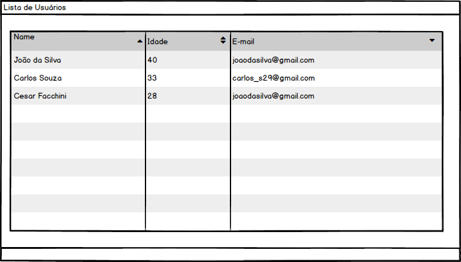
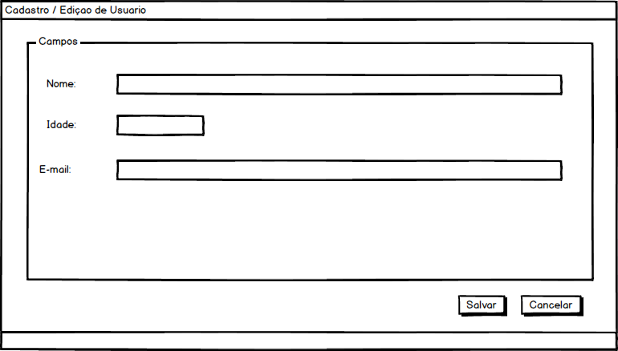

# Desafio Desenvolvedor da Ponto Sistemas

## A Vaga

Para se candidatar:

-   Conhecimento básico das tecnologias fundamentais da web (HTML, CSS, JavaScript e jQuery);
-   Capacidade de comunicação, comprometimento e vontade de pôr a mão na massa;

## O Desafio

Para avaliar o seu conhecimento temos um desafio para você.
Você deverá criar um crud (acrónimo de Create, Read, Update e Delete) de cadastro de usuários.
O mesmo deve ser feito na linguagem que vocÊ preferir, o mesmo deve conter os campos abaixo:

-nome
-idade
-email

A aplicação deve permitir listar, cadastrar, editar e remover.

Segue abaixo algumas imagens como sugestão.

-   Lista de Usuários



-Cadastro de Usuários



Você tem liberdade de desenvolve-lo como bem entender.

Os dados podem ser salvos em um banco de dados, um arquivo, localstorage.

Em caso de dúvidas entre em contato com adronilson@pontosistemas.com.br

OBS: ENVIAR UM BREVE TUTORIAL DE COMO INSTALAR / UTILIZAR A APLICAÇÃO

## Critérios de Avaliação

-   Organização
-   Semântica
-   Decisões Técnicas
-   Ferramentas Utilizadas

## Formas de Entrega

-   E-mail
-   Pull Request
-   Link Repositório

## Tecnologias que utilizamos na Ponto Sistemas

-> Frontend

-   CSS
-   Html
-   JavaScript

-> Backend

-   Java
-   Php

---

# 🖥️ Para rodar:

-   Clone este repositório para a pasta de sua preferência, e navegue até ela;

-   Crie o arquivo .env com os dados para acessar o PostgreSQL, com os dados:

    -   DB_HOST=db
    -   DB_PORT=5432
    -   DB_NAME=desafio
    -   DB_TYPE=pgsql
    -   DB_USER=<seu_usuario>
    -   DB_PASSWORD=<sua_senha>
    -   DB_EMAIL=<seu_email>
        > OBS: O email será seu login no PgAdmin4

-   Instale o cURL:

    ```bash
    $ sudo apt update && sudo apt upgrade
    $ sudo apt install curl
    ```

-   Instale o Docker e o Docker-compose:

    ```bash
    $ curl -fsSL get.docker.com -o get-docker.sh && sh get-docker.sh
    $ curl -L https://github.com/docker/fig/releases/download/1.1.0-rc2/docker-compose-`uname -s`-`uname -m` > /usr/local/bin/docker-compose; chmod +x /usr/local/bin/docker-compose
    ```

-   Rodar o docker-compose.yaml:

    ```bash
    $ docker-compose down --remove-orphans && clear && docker-compose up
    ```

-   Abrir o projeto no navegador em 'http://localhost:8080'

> Foram cerca de 100hs de trabalho no total
